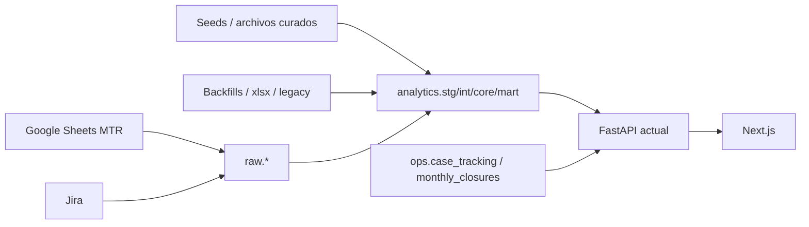
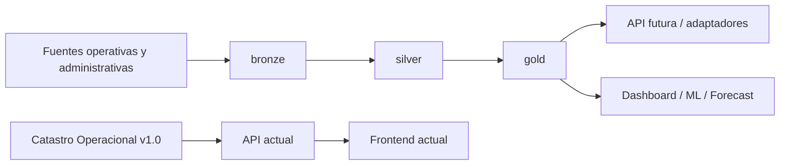

# README ARQUITECTURA

Fecha: 2026-06-18

## Proposito

Catastro es la plataforma de datos y operacion TI que unifica inventario, movimientos, conciliacion operacional, planeacion, compras, calidad de datos, cierres y senales de ML para gestion de activos.

## Problema que resuelve

Antes de Catastro, la lectura del parque dependia de multiples fuentes, hojas manuales, estados no reconciliados y contratos informales entre equipos operativos y analiticos.

Catastro resuelve:

- visibilidad del parque actual
- trazabilidad de movimientos
- conciliacion entre MTR y Jira
- control de calidad del dato
- soporte a compras y renovacion
- snapshot formal de cierres mensuales
- base analitica para ML y forecast

## Componentes principales

- PostgreSQL como plataforma de persistencia
- dbt como capa de modelado
- FastAPI como capa de servicios y contratos
- Next.js como interfaz operacional y ejecutiva
- fuentes externas como Google Sheets MTR, Jira, seeds, backfills y tablas de apoyo

## Arquitectura actual

La arquitectura actual tiene una capa operacional madura concentrada en el schema `analytics`, con apoyo de `raw`, `ops`, `ml` y remanentes `activos`.

## Arquitectura futura Medallion

La evolucion aprobada introduce una linea paralela:

- `bronze` para captura raw o snapshot controlado
- `silver` para entidades y reglas canonicas
- `gold` para datasets publicables y reconciliables

## Estado de madurez

- `Catastro Operacional v1.0`: estable y congelado
- `Sprint 0 Medallion`: completado y documentado
- `Sprint 1 Medallion`: piloto de Calidad implementado y reconciliado
- `Catastro Medallion`: paralelo, validado en un dominio acotado, aun no conectado a consumidores productivos

## Veredicto

Catastro ya no esta en fase exploratoria. La plataforma tiene una linea estable de operacion y una linea paralela de evolucion arquitectonica. El desafio principal no es construir datos nuevos, sino desacoplar contratos con disciplina y reconciliacion.
