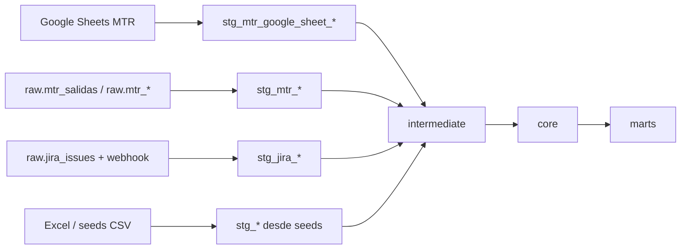

# Mapa dbt Catastro

Documento generado el 2026-05-27 desde `dbt_catastro/target/manifest.json`.

## Resumen

- Modelos dbt detectados: **93**.
- Seeds detectados: **30**.
- Sources detectados: **26**.
- En la columna `Relaciones implícitas` marco tablas o vistas que el SQL consulta sin `source()`/`ref()` y que por eso no aparecen bien reflejadas en el DAG estándar de dbt.

## Vista rápida

## Fuentes raíz y quién las consume directo

| Fuente raíz | Consumidores directos |
|---|---|
| dbt_catastro/seeds/capex_hardware_referencias.csv. | `stg_capex_hardware_referencias` |
| dbt_catastro/seeds/dim_carbon_overrides_manual.csv. | `int_equipo_carbon_matched` |
| dbt_catastro/seeds/dim_costos_modelo_estimados.csv. | `mart_backlog_compras` |
| dbt_catastro/seeds/dim_device_power_profiles.csv. | `int_equipo_carbon_matched` |
| dbt_catastro/seeds/dim_grid_emission_factors_country_year.csv. | `int_equipo_carbon_matched` |
| dbt_catastro/seeds/dim_oem_product_carbon_reports.csv. | `int_equipo_carbon_matched` |
| dbt_catastro/seeds/equipos_lifecycle_override_manual.csv. | `stg_mtr_estado_override` |
| dbt_catastro/seeds/estadisticas_movimientos_override_manual.csv. | `mart_estadistica_movimientos_mes_v2` |
| dbt_catastro/seeds/mtr_equipos_asignados_norm.csv. | `stg_equipos` |
| dbt_catastro/seeds/mtr_salidas_manual.csv. | `stg_mtr_fechas_metricas`, `stg_mtr_salidas_manual`, `stg_mtr_salidas_manual_rechazadas` |
| dbt_catastro/seeds/planeacion_compras_manual.csv. | `stg_planeacion_compras_manual` |
| dbt_catastro/seeds/reparaciones_raw.csv (generado desde `dbt_catastro/seeds/Reparados.xlsx`). | `stg_reparaciones_excel` |
| Google Sheets MTR, sincronizado vía `backend/services/google_sheets_sync.py` con rangos `Equipos Asignados`, `Equipos disponibles`, `Ingresos` y `Salidas`. | `stg_mtr_fechas_metricas`, `stg_mtr_google_sheet_equipos_asignados`, `stg_mtr_google_sheet_equipos_disponibles`, `stg_mtr_google_sheet_ingresos`, `stg_mtr_google_sheet_movimientos_rechazados`, `stg_mtr_google_sheet_salidas` |
| Tabla `analytics.compras_2025_raw` cargada externamente. | `stg_compras_2025_raw` |
| Tabla `analytics.equipos_backfill`, derivada de extracción Excel histórica. | `stg_equipo_specs`, `stg_equipos` |
| Tabla `analytics.equipos_raw`, derivada de extracción Excel histórica. | `stg_equipos` |
| Tabla `analytics.mtr_1202_equ_extranjero_raw` proveniente de una carga histórica desde Excel. | `stg_mtr_1202_equ_extranjero_norm` |
| Tabla `analytics.mtr_1202_equipos_asignados_raw` proveniente de una carga histórica desde Excel. | `stg_mtr_1202_equipos_asignados_norm` |
| Tabla `raw.jira_issues` sincronizada desde Jira Cloud. | `stg_jira_issues` |
| Tabla `raw.mtr_equipos_asignados_detalle` cargada externamente. | `stg_mtr_equipos_asignados_detalle__dq_sku_null`, `stg_mtr_equipos_asignados_detalle__dq_summary` |
| Tabla `raw.mtr_equipos_disponibles` cargada externamente. | `stg_mtr_equipos_disponibles` |
| Tabla `raw.mtr_salidas` cargada externamente. | `stg_mtr_fechas_metricas`, `stg_mtr_salidas` |
| Tabla `raw.raw_jira_webhook_events` alimentada por el webhook de Jira. | `stg_jira_webhook_events` |
| Tabla `raw.sync_runs` con trazas de sincronizaciones del backend. | `mart_equipo_audit_log` |

## Staging

| Modelo | Archivo dbt | Inputs directos | Origen raíz | Relaciones implícitas |
|---|---|---|---|---|
| `stg_capex_hardware_referencias` | `dbt_catastro/models/staging/stg_capex_hardware_referencias.sql` | seed:capex_hardware_referencias.csv | dbt_catastro/seeds/capex_hardware_referencias.csv. | - |
| `stg_compras_2025_raw` | `dbt_catastro/models/staging/stg_compras_2025_raw.sql` | source:analytics.compras_2025_raw | Tabla `analytics.compras_2025_raw` cargada externamente. | - |
| `stg_equipo_specs` | `dbt_catastro/models/staging/stg_equipo_specs.sql` | ref:stg_equipos ref:stg_equipos_enriched ref:stg_mtr_equipos_asignados ref:stg_mtr_equipos_asignados_detalle ref:stg_mtr_equipos_disponibles ref:stg_mtr_google_sheet_equipos_asignados ref:stg_mtr_google_sheet_equipos_disponibles source:analytics.equipos_backfill | dbt_catastro/seeds/mtr_equipos_asignados_norm.csv. Tabla `analytics.equipos_backfill`, derivada de extracción Excel histórica. Tabla `analytics.equipos_raw`, derivada de extracción Excel histórica. Tabla `raw.mtr_equipos_disponibles` cargada externamente. Google Sheets MTR, sincronizado vía `backend/services/google_sheets_sync.py` con rangos `Equipos Asignados`, `Equipos disponibles`, `Ingresos` y `Salidas`. | `analytics.mtr_equipos_asignados` |
| `stg_equipo_sustainability_inputs` | `dbt_catastro/models/staging/stg_equipo_sustainability_inputs.sql` | ref:mart_equipo_specs ref:stg_equipos_enriched ref:stg_mtr_equipos_asignados | dbt_catastro/seeds/mtr_equipos_asignados_norm.csv. Tabla `analytics.equipos_backfill`, derivada de extracción Excel histórica. Tabla `analytics.equipos_raw`, derivada de extracción Excel histórica. Tabla `raw.mtr_equipos_disponibles` cargada externamente. Google Sheets MTR, sincronizado vía `backend/services/google_sheets_sync.py` con rangos `Equipos Asignados`, `Equipos disponibles`, `Ingresos` y `Salidas`. | - |
| `stg_equipos` | `dbt_catastro/models/staging/stg_equipos.sql` | ref:stg_mtr_google_sheet_equipos_asignados seed:mtr_equipos_asignados_norm.csv source:analytics.equipos_backfill source:analytics.equipos_raw | dbt_catastro/seeds/mtr_equipos_asignados_norm.csv. Tabla `analytics.equipos_backfill`, derivada de extracción Excel histórica. Tabla `analytics.equipos_raw`, derivada de extracción Excel histórica. Google Sheets MTR, sincronizado vía `backend/services/google_sheets_sync.py` con rangos `Equipos Asignados`, `Equipos disponibles`, `Ingresos` y `Salidas`. | `analytics.mtr_equipos_asignados` |
| `stg_equipos_enriched` | `dbt_catastro/models/staging/stg_equipos_enriched.sql` | ref:stg_equipos ref:stg_mtr_equipos_asignados ref:stg_mtr_google_sheet_equipos_asignados | dbt_catastro/seeds/mtr_equipos_asignados_norm.csv. Tabla `analytics.equipos_backfill`, derivada de extracción Excel histórica. Tabla `analytics.equipos_raw`, derivada de extracción Excel histórica. Google Sheets MTR, sincronizado vía `backend/services/google_sheets_sync.py` con rangos `Equipos Asignados`, `Equipos disponibles`, `Ingresos` y `Salidas`. | `analytics.v_tmp_mtr0903_equipos_asignados_norm` |
| `stg_equipos_enriched__dq_missing_specs` | `dbt_catastro/models/staging/stg_equipos_enriched__dq_missing_specs.sql` | ref:stg_equipos_enriched | dbt_catastro/seeds/mtr_equipos_asignados_norm.csv. Tabla `analytics.equipos_backfill`, derivada de extracción Excel histórica. Tabla `analytics.equipos_raw`, derivada de extracción Excel histórica. Google Sheets MTR, sincronizado vía `backend/services/google_sheets_sync.py` con rangos `Equipos Asignados`, `Equipos disponibles`, `Ingresos` y `Salidas`. | - |
| `stg_historia_hw` | `dbt_catastro/models/staging/stg_historia_hw.sql` | ref:mart_historia_eventos | dbt_catastro/seeds/mtr_salidas_manual.csv. Google Sheets MTR, sincronizado vía `backend/services/google_sheets_sync.py` con rangos `Equipos Asignados`, `Equipos disponibles`, `Ingresos` y `Salidas`. Tabla `raw.mtr_salidas` cargada externamente. | - |
| `stg_jira_issues` | `dbt_catastro/models/staging/stg_jira_issues.sql` | source:raw.jira_issues | Tabla `raw.jira_issues` sincronizada desde Jira Cloud. | - |
| `stg_jira_webhook_events` | `dbt_catastro/models/staging/stg_jira_webhook_events.sql` | source:raw.raw_jira_webhook_events | Tabla `raw.raw_jira_webhook_events` alimentada por el webhook de Jira. | - |
| `stg_ml_features_equipos` | `dbt_catastro/models/staging/stg_ml_features_equipos.sql` | ref:stg_historia_hw | dbt_catastro/seeds/mtr_salidas_manual.csv. Google Sheets MTR, sincronizado vía `backend/services/google_sheets_sync.py` con rangos `Equipos Asignados`, `Equipos disponibles`, `Ingresos` y `Salidas`. Tabla `raw.mtr_salidas` cargada externamente. | - |
| `stg_mtr_1202_equ_extranjero_norm` | `dbt_catastro/models/staging/stg_mtr_1202_equ_extranjero_norm.sql` | source:analytics.mtr_1202_equ_extranjero_raw | Tabla `analytics.mtr_1202_equ_extranjero_raw` proveniente de una carga histórica desde Excel. | - |
| `stg_mtr_1202_equipos_asignados_norm` | `dbt_catastro/models/staging/stg_mtr_1202_equipos_asignados_norm.sql` | source:analytics.mtr_1202_equipos_asignados_raw | Tabla `analytics.mtr_1202_equipos_asignados_raw` proveniente de una carga histórica desde Excel. | - |
| `stg_mtr_equipos_asignados` | `dbt_catastro/models/staging/stg_mtr_equipos_asignados.sql` | ref:stg_mtr_google_sheet_equipos_asignados | Google Sheets MTR, sincronizado vía `backend/services/google_sheets_sync.py` con rangos `Equipos Asignados`, `Equipos disponibles`, `Ingresos` y `Salidas`. | `analytics.v_mtr0903_equipos_asignados_norm_compat` |
| `stg_mtr_equipos_asignados_detalle` | `dbt_catastro/models/staging/stg_mtr_equipos_asignados_detalle.sql` | - | - | `analytics.mtr_equipos_asignados_xlsx` |
| `stg_mtr_equipos_asignados_detalle__dq_sku_null` | `dbt_catastro/models/staging/stg_mtr_equipos_asignados_detalle__dq_sku_null.sql` | source:raw.mtr_equipos_asignados_detalle | Tabla `raw.mtr_equipos_asignados_detalle` cargada externamente. | - |
| `stg_mtr_equipos_asignados_detalle__dq_summary` | `dbt_catastro/models/staging/stg_mtr_equipos_asignados_detalle__dq_summary.sql` | ref:stg_mtr_equipos_asignados_detalle ref:stg_mtr_equipos_asignados_detalle__dq_sku_null source:raw.mtr_equipos_asignados_detalle | Tabla `raw.mtr_equipos_asignados_detalle` cargada externamente. | - |
| `stg_mtr_equipos_disponibles` | `dbt_catastro/models/staging/stg_mtr_equipos_disponibles.sql` | source:raw.mtr_equipos_disponibles | Tabla `raw.mtr_equipos_disponibles` cargada externamente. | - |
| `stg_mtr_estado_override` | `dbt_catastro/models/staging/stg_mtr_estado_override.sql` | seed:equipos_lifecycle_override_manual.csv | dbt_catastro/seeds/equipos_lifecycle_override_manual.csv. | - |
| `stg_mtr_eventos_clean` | `dbt_catastro/models/staging/stg_mtr_eventos_clean.sql` | ref:stg_mtr_google_sheet_ingresos ref:stg_mtr_google_sheet_salidas | Google Sheets MTR, sincronizado vía `backend/services/google_sheets_sync.py` con rangos `Equipos Asignados`, `Equipos disponibles`, `Ingresos` y `Salidas`. | - |
| `stg_mtr_fechas_metricas` | `dbt_catastro/models/staging/stg_mtr_fechas_metricas.sql` | seed:mtr_salidas_manual.csv source:raw.mtr_google_sheet_rows source:raw.mtr_salidas | dbt_catastro/seeds/mtr_salidas_manual.csv. Google Sheets MTR, sincronizado vía `backend/services/google_sheets_sync.py` con rangos `Equipos Asignados`, `Equipos disponibles`, `Ingresos` y `Salidas`. Tabla `raw.mtr_salidas` cargada externamente. | `analytics.mtr_equipos_asignados_xlsx` |
| `stg_mtr_google_sheet_equipos_asignados` | `dbt_catastro/models/staging/stg_mtr_google_sheet_equipos_asignados.sql` | source:raw.mtr_google_sheet_rows | Google Sheets MTR, sincronizado vía `backend/services/google_sheets_sync.py` con rangos `Equipos Asignados`, `Equipos disponibles`, `Ingresos` y `Salidas`. | - |
| `stg_mtr_google_sheet_equipos_disponibles` | `dbt_catastro/models/staging/stg_mtr_google_sheet_equipos_disponibles.sql` | source:raw.mtr_google_sheet_rows | Google Sheets MTR, sincronizado vía `backend/services/google_sheets_sync.py` con rangos `Equipos Asignados`, `Equipos disponibles`, `Ingresos` y `Salidas`. | - |
| `stg_mtr_google_sheet_ingresos` | `dbt_catastro/models/staging/stg_mtr_google_sheet_ingresos.sql` | source:raw.mtr_google_sheet_rows | Google Sheets MTR, sincronizado vía `backend/services/google_sheets_sync.py` con rangos `Equipos Asignados`, `Equipos disponibles`, `Ingresos` y `Salidas`. | - |
| `stg_mtr_google_sheet_movimientos_rechazados` | `dbt_catastro/models/staging/stg_mtr_google_sheet_movimientos_rechazados.sql` | source:raw.mtr_google_sheet_rows | Google Sheets MTR, sincronizado vía `backend/services/google_sheets_sync.py` con rangos `Equipos Asignados`, `Equipos disponibles`, `Ingresos` y `Salidas`. | - |
| `stg_mtr_google_sheet_salidas` | `dbt_catastro/models/staging/stg_mtr_google_sheet_salidas.sql` | source:raw.mtr_google_sheet_rows | Google Sheets MTR, sincronizado vía `backend/services/google_sheets_sync.py` con rangos `Equipos Asignados`, `Equipos disponibles`, `Ingresos` y `Salidas`. | - |
| `stg_mtr_ingresos` | `dbt_catastro/models/staging/stg_mtr_ingresos.sql` | ref:stg_mtr_google_sheet_ingresos | Google Sheets MTR, sincronizado vía `backend/services/google_sheets_sync.py` con rangos `Equipos Asignados`, `Equipos disponibles`, `Ingresos` y `Salidas`. | `analytics.mtr_ingresos_xlsx` |
| `stg_mtr_salidas` | `dbt_catastro/models/staging/stg_mtr_salidas.sql` | ref:stg_mtr_google_sheet_salidas ref:stg_mtr_salidas_manual source:raw.mtr_salidas | dbt_catastro/seeds/mtr_salidas_manual.csv. Google Sheets MTR, sincronizado vía `backend/services/google_sheets_sync.py` con rangos `Equipos Asignados`, `Equipos disponibles`, `Ingresos` y `Salidas`. Tabla `raw.mtr_salidas` cargada externamente. | `analytics.mtr_salidas_xlsx` |
| `stg_mtr_salidas_manual` | `dbt_catastro/models/staging/stg_mtr_salidas_manual.sql` | seed:mtr_salidas_manual.csv | dbt_catastro/seeds/mtr_salidas_manual.csv. | - |
| `stg_mtr_salidas_manual_rechazadas` | `dbt_catastro/models/staging/stg_mtr_salidas_manual_rechazadas.sql` | seed:mtr_salidas_manual.csv | dbt_catastro/seeds/mtr_salidas_manual.csv. | - |
| `stg_planeacion_compras_manual` | `dbt_catastro/models/staging/stg_planeacion_compras_manual.sql` | seed:planeacion_compras_manual.csv | dbt_catastro/seeds/planeacion_compras_manual.csv. | - |
| `stg_reparaciones_excel` | `dbt_catastro/models/staging/stg_reparaciones_excel.sql` | seed:reparaciones_raw.csv | dbt_catastro/seeds/reparaciones_raw.csv (generado desde `dbt_catastro/seeds/Reparados.xlsx`). | - |

## Intermediate

| Modelo | Archivo dbt | Inputs directos | Origen raíz | Relaciones implícitas |
|---|---|---|---|---|
| `int_equipo_carbon_calculated` | `dbt_catastro/models/intermediate/int_equipo_carbon_calculated.sql` | ref:int_equipo_carbon_matched | dbt_catastro/seeds/dim_carbon_overrides_manual.csv. dbt_catastro/seeds/dim_device_power_profiles.csv. dbt_catastro/seeds/dim_grid_emission_factors_country_year.csv. dbt_catastro/seeds/dim_oem_product_carbon_reports.csv. dbt_catastro/seeds/mtr_equipos_asignados_norm.csv. Tabla `analytics.equipos_backfill`, derivada de extracción Excel histórica. Tabla `analytics.equipos_raw`, derivada de extracción Excel histórica. Tabla `raw.mtr_equipos_disponibles` cargada externamente. Google Sheets MTR, sincronizado vía `backend/services/google_sheets_sync.py` con rangos `Equipos Asignados`, `Equipos disponibles`, `Ingresos` y `Salidas`. | - |
| `int_equipo_carbon_matched` | `dbt_catastro/models/intermediate/int_equipo_carbon_matched.sql` | ref:stg_equipo_sustainability_inputs seed:dim_carbon_overrides_manual.csv seed:dim_device_power_profiles.csv seed:dim_grid_emission_factors_country_year.csv seed:dim_oem_product_carbon_reports.csv | dbt_catastro/seeds/dim_carbon_overrides_manual.csv. dbt_catastro/seeds/dim_device_power_profiles.csv. dbt_catastro/seeds/dim_grid_emission_factors_country_year.csv. dbt_catastro/seeds/dim_oem_product_carbon_reports.csv. dbt_catastro/seeds/mtr_equipos_asignados_norm.csv. Tabla `analytics.equipos_backfill`, derivada de extracción Excel histórica. Tabla `analytics.equipos_raw`, derivada de extracción Excel histórica. Tabla `raw.mtr_equipos_disponibles` cargada externamente. Google Sheets MTR, sincronizado vía `backend/services/google_sheets_sync.py` con rangos `Equipos Asignados`, `Equipos disponibles`, `Ingresos` y `Salidas`. | - |
| `int_equipo_jira_rollup` | `dbt_catastro/models/intermediate/int_equipo_jira_rollup.sql` | ref:stg_jira_issues | Tabla `raw.jira_issues` sincronizada desde Jira Cloud. | - |
| `int_equipo_specs_normalized` | `dbt_catastro/models/intermediate/int_equipo_specs_normalized.sql` | ref:stg_equipo_specs | dbt_catastro/seeds/mtr_equipos_asignados_norm.csv. Tabla `analytics.equipos_backfill`, derivada de extracción Excel histórica. Tabla `analytics.equipos_raw`, derivada de extracción Excel histórica. Tabla `raw.mtr_equipos_disponibles` cargada externamente. Google Sheets MTR, sincronizado vía `backend/services/google_sheets_sync.py` con rangos `Equipos Asignados`, `Equipos disponibles`, `Ingresos` y `Salidas`. | - |
| `int_funcion_por_equipo` | `dbt_catastro/models/intermediate/int_funcion_por_equipo.sql` | ref:stg_equipos_enriched | dbt_catastro/seeds/mtr_equipos_asignados_norm.csv. Tabla `analytics.equipos_backfill`, derivada de extracción Excel histórica. Tabla `analytics.equipos_raw`, derivada de extracción Excel histórica. Google Sheets MTR, sincronizado vía `backend/services/google_sheets_sync.py` con rangos `Equipos Asignados`, `Equipos disponibles`, `Ingresos` y `Salidas`. | - |
| `int_historia_asignaciones` | `dbt_catastro/models/intermediate/int_historia_asignaciones.sql` | ref:stg_mtr_equipos_asignados ref:stg_mtr_ingresos ref:stg_mtr_salidas | dbt_catastro/seeds/mtr_salidas_manual.csv. Google Sheets MTR, sincronizado vía `backend/services/google_sheets_sync.py` con rangos `Equipos Asignados`, `Equipos disponibles`, `Ingresos` y `Salidas`. Tabla `raw.mtr_salidas` cargada externamente. | - |
| `int_ml_scores_best_latest` | `dbt_catastro/models/intermediate/int_ml_scores_best_latest.sql` | - | - | `analytics.ml_scores_latest` `analytics.ml_scores_v2_latest` |
| `int_ml_scores_v2_latest` | `dbt_catastro/models/intermediate/int_ml_scores_v2_latest.sql` | - | - | `ml.vw_scores_v2_latest` |
| `int_ml_scores_v3_latest` | `dbt_catastro/models/intermediate/int_ml_scores_v3_latest.sql` | - | - | `analytics.mart_equipos_estado_actual` |
| `int_mtr_eventos_dedup` | `dbt_catastro/models/intermediate/int_mtr_eventos_dedup.sql` | ref:stg_mtr_eventos_clean | Google Sheets MTR, sincronizado vía `backend/services/google_sheets_sync.py` con rangos `Equipos Asignados`, `Equipos disponibles`, `Ingresos` y `Salidas`. | - |
| `int_mtr_eventos_dedup_stats` | `dbt_catastro/models/intermediate/int_mtr_eventos_dedup_stats.sql` | ref:stg_mtr_eventos_clean ref:stg_mtr_google_sheet_equipos_asignados | Google Sheets MTR, sincronizado vía `backend/services/google_sheets_sync.py` con rangos `Equipos Asignados`, `Equipos disponibles`, `Ingresos` y `Salidas`. | - |
| `int_politica_equipos` | `dbt_catastro/models/intermediate/int_politica_equipos.sql` | ref:stg_equipos_enriched | dbt_catastro/seeds/mtr_equipos_asignados_norm.csv. Tabla `analytics.equipos_backfill`, derivada de extracción Excel histórica. Tabla `analytics.equipos_raw`, derivada de extracción Excel histórica. Google Sheets MTR, sincronizado vía `backend/services/google_sheets_sync.py` con rangos `Equipos Asignados`, `Equipos disponibles`, `Ingresos` y `Salidas`. | - |
| `int_presion_base` | `dbt_catastro/models/intermediate/int_presion_base.sql` | ref:int_equipo_jira_rollup ref:mart_historia_eventos ref:stg_mtr_equipos_asignados | dbt_catastro/seeds/mtr_salidas_manual.csv. Tabla `raw.jira_issues` sincronizada desde Jira Cloud. Google Sheets MTR, sincronizado vía `backend/services/google_sheets_sync.py` con rangos `Equipos Asignados`, `Equipos disponibles`, `Ingresos` y `Salidas`. Tabla `raw.mtr_salidas` cargada externamente. | - |
| `int_presion_stock` | `dbt_catastro/models/intermediate/int_presion_stock.sql` | ref:int_politica_equipos ref:int_presion_base | dbt_catastro/seeds/mtr_equipos_asignados_norm.csv. dbt_catastro/seeds/mtr_salidas_manual.csv. Tabla `analytics.equipos_backfill`, derivada de extracción Excel histórica. Tabla `analytics.equipos_raw`, derivada de extracción Excel histórica. Tabla `raw.jira_issues` sincronizada desde Jira Cloud. Google Sheets MTR, sincronizado vía `backend/services/google_sheets_sync.py` con rangos `Equipos Asignados`, `Equipos disponibles`, `Ingresos` y `Salidas`. Tabla `raw.mtr_salidas` cargada externamente. | - |

## Core

| Modelo | Archivo dbt | Inputs directos | Origen raíz | Relaciones implícitas |
|---|---|---|---|---|
| `fact_compras_2025` | `dbt_catastro/models/core/fact_compras_2025.sql` | ref:stg_compras_2025_raw | Tabla `analytics.compras_2025_raw` cargada externamente. | - |
| `fact_planeacion_compras` | `dbt_catastro/models/core/fact_planeacion_compras.sql` | ref:stg_planeacion_compras_manual | dbt_catastro/seeds/planeacion_compras_manual.csv. | - |
| `fct_historia_hw` | `dbt_catastro/models/core/fct_historia_hw.sql` | ref:stg_equipos ref:stg_historia_hw | dbt_catastro/seeds/mtr_equipos_asignados_norm.csv. dbt_catastro/seeds/mtr_salidas_manual.csv. Tabla `analytics.equipos_backfill`, derivada de extracción Excel histórica. Tabla `analytics.equipos_raw`, derivada de extracción Excel histórica. Google Sheets MTR, sincronizado vía `backend/services/google_sheets_sync.py` con rangos `Equipos Asignados`, `Equipos disponibles`, `Ingresos` y `Salidas`. Tabla `raw.mtr_salidas` cargada externamente. | - |
| `fct_movimientos_detalle` | `dbt_catastro/models/core/fct_movimientos_detalle.sql` | ref:stg_mtr_google_sheet_equipos_asignados ref:stg_mtr_ingresos ref:stg_mtr_salidas | dbt_catastro/seeds/mtr_salidas_manual.csv. Google Sheets MTR, sincronizado vía `backend/services/google_sheets_sync.py` con rangos `Equipos Asignados`, `Equipos disponibles`, `Ingresos` y `Salidas`. Tabla `raw.mtr_salidas` cargada externamente. | - |

## Marts

| Modelo | Archivo dbt | Inputs directos | Origen raíz | Relaciones implícitas |
|---|---|---|---|---|
| `dim_sku_os` | `dbt_catastro/models/marts/dim_sku_os.sql` | - | - | `analytics.mtr_ingresos` `analytics.mtr_salidas` |
| `fct_ml_features_equipos` | `dbt_catastro/models/marts/fct_ml_features_equipos.sql` | ref:stg_ml_features_equipos | dbt_catastro/seeds/mtr_salidas_manual.csv. Google Sheets MTR, sincronizado vía `backend/services/google_sheets_sync.py` con rangos `Equipos Asignados`, `Equipos disponibles`, `Ingresos` y `Salidas`. Tabla `raw.mtr_salidas` cargada externamente. | - |
| `mart_acciones_vs_movimientos_mes` | `dbt_catastro/models/marts/mart_acciones_vs_movimientos_mes.sql` | ref:int_ml_scores_best_latest | - | `analytics.mart_alertas_acciones` `analytics.mart_estadistica_movimientos_mes` |
| `mart_alertas_acciones` | `dbt_catastro/models/marts/mart_alertas_acciones.sql` | - | - | `analytics.mart_equipos_estado_actual` |
| `mart_backlog_compras` | `dbt_catastro/models/marts/mart_backlog_compras.sql` | ref:mart_equipos_estado_actual ref:mart_ranking_global seed:dim_costos_modelo_estimados.csv | dbt_catastro/seeds/dim_carbon_overrides_manual.csv. dbt_catastro/seeds/dim_costos_modelo_estimados.csv. dbt_catastro/seeds/dim_device_power_profiles.csv. dbt_catastro/seeds/dim_grid_emission_factors_country_year.csv. dbt_catastro/seeds/dim_oem_product_carbon_reports.csv. dbt_catastro/seeds/equipos_lifecycle_override_manual.csv. dbt_catastro/seeds/mtr_equipos_asignados_norm.csv. dbt_catastro/seeds/mtr_salidas_manual.csv. Tabla `analytics.equipos_backfill`, derivada de extracción Excel histórica. Tabla `analytics.equipos_raw`, derivada de extracción Excel histórica. Tabla `raw.jira_issues` sincronizada desde Jira Cloud. Tabla `raw.mtr_equipos_disponibles` cargada externamente. Google Sheets MTR, sincronizado vía `backend/services/google_sheets_sync.py` con rangos `Equipos Asignados`, `Equipos disponibles`, `Ingresos` y `Salidas`. Tabla `raw.mtr_salidas` cargada externamente. | - |
| `mart_catastro_historia_eventos` | `dbt_catastro/models/marts/mart_catastro_historia_eventos.sql` | ref:int_mtr_eventos_dedup_stats ref:mart_equipos_estado_actual ref:stg_mtr_google_sheet_equipos_asignados | dbt_catastro/seeds/dim_carbon_overrides_manual.csv. dbt_catastro/seeds/dim_device_power_profiles.csv. dbt_catastro/seeds/dim_grid_emission_factors_country_year.csv. dbt_catastro/seeds/dim_oem_product_carbon_reports.csv. dbt_catastro/seeds/equipos_lifecycle_override_manual.csv. dbt_catastro/seeds/mtr_equipos_asignados_norm.csv. dbt_catastro/seeds/mtr_salidas_manual.csv. Tabla `analytics.equipos_backfill`, derivada de extracción Excel histórica. Tabla `analytics.equipos_raw`, derivada de extracción Excel histórica. Tabla `raw.jira_issues` sincronizada desde Jira Cloud. Tabla `raw.mtr_equipos_disponibles` cargada externamente. Google Sheets MTR, sincronizado vía `backend/services/google_sheets_sync.py` con rangos `Equipos Asignados`, `Equipos disponibles`, `Ingresos` y `Salidas`. Tabla `raw.mtr_salidas` cargada externamente. | - |
| `mart_catastro_historia_mensual` | `dbt_catastro/models/marts/mart_catastro_historia_mensual.sql` | ref:fct_movimientos_detalle ref:int_mtr_eventos_dedup_stats ref:mart_catastro_historia_eventos ref:mart_equipos_estado_actual ref:stg_mtr_google_sheet_equipos_disponibles | dbt_catastro/seeds/dim_carbon_overrides_manual.csv. dbt_catastro/seeds/dim_device_power_profiles.csv. dbt_catastro/seeds/dim_grid_emission_factors_country_year.csv. dbt_catastro/seeds/dim_oem_product_carbon_reports.csv. dbt_catastro/seeds/equipos_lifecycle_override_manual.csv. dbt_catastro/seeds/mtr_equipos_asignados_norm.csv. dbt_catastro/seeds/mtr_salidas_manual.csv. Tabla `analytics.equipos_backfill`, derivada de extracción Excel histórica. Tabla `analytics.equipos_raw`, derivada de extracción Excel histórica. Tabla `raw.jira_issues` sincronizada desde Jira Cloud. Tabla `raw.mtr_equipos_disponibles` cargada externamente. Google Sheets MTR, sincronizado vía `backend/services/google_sheets_sync.py` con rangos `Equipos Asignados`, `Equipos disponibles`, `Ingresos` y `Salidas`. Tabla `raw.mtr_salidas` cargada externamente. | - |
| `mart_catastro_historia_mensual_dimension` | `dbt_catastro/models/marts/mart_catastro_historia_mensual_dimension.sql` | ref:mart_catastro_historia_eventos | dbt_catastro/seeds/dim_carbon_overrides_manual.csv. dbt_catastro/seeds/dim_device_power_profiles.csv. dbt_catastro/seeds/dim_grid_emission_factors_country_year.csv. dbt_catastro/seeds/dim_oem_product_carbon_reports.csv. dbt_catastro/seeds/equipos_lifecycle_override_manual.csv. dbt_catastro/seeds/mtr_equipos_asignados_norm.csv. dbt_catastro/seeds/mtr_salidas_manual.csv. Tabla `analytics.equipos_backfill`, derivada de extracción Excel histórica. Tabla `analytics.equipos_raw`, derivada de extracción Excel histórica. Tabla `raw.jira_issues` sincronizada desde Jira Cloud. Tabla `raw.mtr_equipos_disponibles` cargada externamente. Google Sheets MTR, sincronizado vía `backend/services/google_sheets_sync.py` con rangos `Equipos Asignados`, `Equipos disponibles`, `Ingresos` y `Salidas`. Tabla `raw.mtr_salidas` cargada externamente. | - |
| `mart_compras_mensual_mtr` | `dbt_catastro/models/marts/mart_compras_mensual_mtr.sql` | ref:fact_compras_2025 | Tabla `analytics.compras_2025_raw` cargada externamente. | - |
| `mart_confianza_dato` | `dbt_catastro/models/marts/mart_confianza_dato.sql` | ref:mart_equipo_audit_log ref:mart_mtr_jira_reconciliacion | dbt_catastro/seeds/mtr_equipos_asignados_norm.csv. dbt_catastro/seeds/mtr_salidas_manual.csv. dbt_catastro/seeds/reparaciones_raw.csv (generado desde `dbt_catastro/seeds/Reparados.xlsx`). Tabla `analytics.equipos_backfill`, derivada de extracción Excel histórica. Tabla `analytics.equipos_raw`, derivada de extracción Excel histórica. Tabla `raw.jira_issues` sincronizada desde Jira Cloud. Google Sheets MTR, sincronizado vía `backend/services/google_sheets_sync.py` con rangos `Equipos Asignados`, `Equipos disponibles`, `Ingresos` y `Salidas`. Tabla `raw.mtr_salidas` cargada externamente. Tabla `raw.raw_jira_webhook_events` alimentada por el webhook de Jira. Tabla `raw.sync_runs` con trazas de sincronizaciones del backend. | - |
| `mart_dashboard_extranjeros` | `dbt_catastro/models/marts/mart_dashboard_extranjeros.sql` | ref:stg_mtr_1202_equ_extranjero_norm ref:stg_mtr_1202_equipos_asignados_norm | Tabla `analytics.mtr_1202_equ_extranjero_raw` proveniente de una carga histórica desde Excel. Tabla `analytics.mtr_1202_equipos_asignados_raw` proveniente de una carga histórica desde Excel. | - |
| `mart_equipo_audit_log` | `dbt_catastro/models/marts/mart_equipo_audit_log.sql` | ref:int_mtr_eventos_dedup_stats ref:mart_equipo_timeline ref:mart_mtr_jira_reconciliacion ref:stg_jira_issues ref:stg_jira_webhook_events ref:stg_mtr_google_sheet_equipos_asignados ref:stg_mtr_google_sheet_equipos_disponibles ref:stg_reparaciones_excel source:raw.sync_runs | dbt_catastro/seeds/mtr_equipos_asignados_norm.csv. dbt_catastro/seeds/mtr_salidas_manual.csv. dbt_catastro/seeds/reparaciones_raw.csv (generado desde `dbt_catastro/seeds/Reparados.xlsx`). Tabla `analytics.equipos_backfill`, derivada de extracción Excel histórica. Tabla `analytics.equipos_raw`, derivada de extracción Excel histórica. Tabla `raw.jira_issues` sincronizada desde Jira Cloud. Google Sheets MTR, sincronizado vía `backend/services/google_sheets_sync.py` con rangos `Equipos Asignados`, `Equipos disponibles`, `Ingresos` y `Salidas`. Tabla `raw.mtr_salidas` cargada externamente. Tabla `raw.raw_jira_webhook_events` alimentada por el webhook de Jira. Tabla `raw.sync_runs` con trazas de sincronizaciones del backend. | - |
| `mart_equipo_specs` | `dbt_catastro/models/marts/mart_equipo_specs.sql` | ref:int_equipo_specs_normalized | dbt_catastro/seeds/mtr_equipos_asignados_norm.csv. Tabla `analytics.equipos_backfill`, derivada de extracción Excel histórica. Tabla `analytics.equipos_raw`, derivada de extracción Excel histórica. Tabla `raw.mtr_equipos_disponibles` cargada externamente. Google Sheets MTR, sincronizado vía `backend/services/google_sheets_sync.py` con rangos `Equipos Asignados`, `Equipos disponibles`, `Ingresos` y `Salidas`. | - |
| `mart_equipo_sustainability` | `dbt_catastro/models/marts/mart_equipo_sustainability.sql` | ref:int_equipo_carbon_calculated | dbt_catastro/seeds/dim_carbon_overrides_manual.csv. dbt_catastro/seeds/dim_device_power_profiles.csv. dbt_catastro/seeds/dim_grid_emission_factors_country_year.csv. dbt_catastro/seeds/dim_oem_product_carbon_reports.csv. dbt_catastro/seeds/mtr_equipos_asignados_norm.csv. Tabla `analytics.equipos_backfill`, derivada de extracción Excel histórica. Tabla `analytics.equipos_raw`, derivada de extracción Excel histórica. Tabla `raw.mtr_equipos_disponibles` cargada externamente. Google Sheets MTR, sincronizado vía `backend/services/google_sheets_sync.py` con rangos `Equipos Asignados`, `Equipos disponibles`, `Ingresos` y `Salidas`. | - |
| `mart_equipo_timeline` | `dbt_catastro/models/marts/mart_equipo_timeline.sql` | ref:fct_historia_hw ref:stg_jira_issues | dbt_catastro/seeds/mtr_equipos_asignados_norm.csv. dbt_catastro/seeds/mtr_salidas_manual.csv. Tabla `analytics.equipos_backfill`, derivada de extracción Excel histórica. Tabla `analytics.equipos_raw`, derivada de extracción Excel histórica. Tabla `raw.jira_issues` sincronizada desde Jira Cloud. Google Sheets MTR, sincronizado vía `backend/services/google_sheets_sync.py` con rangos `Equipos Asignados`, `Equipos disponibles`, `Ingresos` y `Salidas`. Tabla `raw.mtr_salidas` cargada externamente. | - |
| `mart_equipo_timeline_v2` | `dbt_catastro/models/marts/mart_equipo_timeline_v2.sql` | ref:mart_equipo_timeline ref:stg_reparaciones_excel | dbt_catastro/seeds/mtr_equipos_asignados_norm.csv. dbt_catastro/seeds/mtr_salidas_manual.csv. dbt_catastro/seeds/reparaciones_raw.csv (generado desde `dbt_catastro/seeds/Reparados.xlsx`). Tabla `analytics.equipos_backfill`, derivada de extracción Excel histórica. Tabla `analytics.equipos_raw`, derivada de extracción Excel histórica. Tabla `raw.jira_issues` sincronizada desde Jira Cloud. Google Sheets MTR, sincronizado vía `backend/services/google_sheets_sync.py` con rangos `Equipos Asignados`, `Equipos disponibles`, `Ingresos` y `Salidas`. Tabla `raw.mtr_salidas` cargada externamente. | - |
| `mart_equipos_estado_actual` | `dbt_catastro/models/marts/mart_equipos_estado_actual.sql` | ref:int_equipo_jira_rollup ref:int_ml_scores_v2_latest ref:int_ml_scores_v3_latest ref:int_politica_equipos ref:int_presion_stock ref:mart_equipo_specs ref:mart_equipo_sustainability ref:mart_historia_eventos ref:stg_equipos_enriched ref:stg_mtr_equipos_asignados ref:stg_mtr_estado_override | dbt_catastro/seeds/dim_carbon_overrides_manual.csv. dbt_catastro/seeds/dim_device_power_profiles.csv. dbt_catastro/seeds/dim_grid_emission_factors_country_year.csv. dbt_catastro/seeds/dim_oem_product_carbon_reports.csv. dbt_catastro/seeds/equipos_lifecycle_override_manual.csv. dbt_catastro/seeds/mtr_equipos_asignados_norm.csv. dbt_catastro/seeds/mtr_salidas_manual.csv. Tabla `analytics.equipos_backfill`, derivada de extracción Excel histórica. Tabla `analytics.equipos_raw`, derivada de extracción Excel histórica. Tabla `raw.jira_issues` sincronizada desde Jira Cloud. Tabla `raw.mtr_equipos_disponibles` cargada externamente. Google Sheets MTR, sincronizado vía `backend/services/google_sheets_sync.py` con rangos `Equipos Asignados`, `Equipos disponibles`, `Ingresos` y `Salidas`. Tabla `raw.mtr_salidas` cargada externamente. | `analytics.int_ml_scores_v3_latest` |
| `mart_equipos_estado_actual_politica` | `dbt_catastro/models/marts/mart_equipos_estado_actual_politica.sql` | ref:mart_equipos_estado_actual | dbt_catastro/seeds/dim_carbon_overrides_manual.csv. dbt_catastro/seeds/dim_device_power_profiles.csv. dbt_catastro/seeds/dim_grid_emission_factors_country_year.csv. dbt_catastro/seeds/dim_oem_product_carbon_reports.csv. dbt_catastro/seeds/equipos_lifecycle_override_manual.csv. dbt_catastro/seeds/mtr_equipos_asignados_norm.csv. dbt_catastro/seeds/mtr_salidas_manual.csv. Tabla `analytics.equipos_backfill`, derivada de extracción Excel histórica. Tabla `analytics.equipos_raw`, derivada de extracción Excel histórica. Tabla `raw.jira_issues` sincronizada desde Jira Cloud. Tabla `raw.mtr_equipos_disponibles` cargada externamente. Google Sheets MTR, sincronizado vía `backend/services/google_sheets_sync.py` con rangos `Equipos Asignados`, `Equipos disponibles`, `Ingresos` y `Salidas`. Tabla `raw.mtr_salidas` cargada externamente. | - |
| `mart_equipos_estado_actual_v2` | `dbt_catastro/models/marts/mart_equipos_estado_actual_v2.sql` | ref:mart_equipos_estado_actual | dbt_catastro/seeds/dim_carbon_overrides_manual.csv. dbt_catastro/seeds/dim_device_power_profiles.csv. dbt_catastro/seeds/dim_grid_emission_factors_country_year.csv. dbt_catastro/seeds/dim_oem_product_carbon_reports.csv. dbt_catastro/seeds/equipos_lifecycle_override_manual.csv. dbt_catastro/seeds/mtr_equipos_asignados_norm.csv. dbt_catastro/seeds/mtr_salidas_manual.csv. Tabla `analytics.equipos_backfill`, derivada de extracción Excel histórica. Tabla `analytics.equipos_raw`, derivada de extracción Excel histórica. Tabla `raw.jira_issues` sincronizada desde Jira Cloud. Tabla `raw.mtr_equipos_disponibles` cargada externamente. Google Sheets MTR, sincronizado vía `backend/services/google_sheets_sync.py` con rangos `Equipos Asignados`, `Equipos disponibles`, `Ingresos` y `Salidas`. Tabla `raw.mtr_salidas` cargada externamente. | `analytics.ml_scores_v2_history` `analytics.tmp_mtr1903_asignacion_actual` `analytics.v_mtr1203_ml_scores_latest` |
| `mart_equipos_estado_actual_v3` | `dbt_catastro/models/marts/mart_equipos_estado_actual_v3.sql` | ref:mart_equipos_estado_actual_v2 | dbt_catastro/seeds/dim_carbon_overrides_manual.csv. dbt_catastro/seeds/dim_device_power_profiles.csv. dbt_catastro/seeds/dim_grid_emission_factors_country_year.csv. dbt_catastro/seeds/dim_oem_product_carbon_reports.csv. dbt_catastro/seeds/equipos_lifecycle_override_manual.csv. dbt_catastro/seeds/mtr_equipos_asignados_norm.csv. dbt_catastro/seeds/mtr_salidas_manual.csv. Tabla `analytics.equipos_backfill`, derivada de extracción Excel histórica. Tabla `analytics.equipos_raw`, derivada de extracción Excel histórica. Tabla `raw.jira_issues` sincronizada desde Jira Cloud. Tabla `raw.mtr_equipos_disponibles` cargada externamente. Google Sheets MTR, sincronizado vía `backend/services/google_sheets_sync.py` con rangos `Equipos Asignados`, `Equipos disponibles`, `Ingresos` y `Salidas`. Tabla `raw.mtr_salidas` cargada externamente. | `analytics.equipos_backfill` `analytics.v_mtr1203_equipos_asignados_latest_norm` |
| `mart_estadistica_movimientos_mes` | `dbt_catastro/models/marts/mart_estadistica_movimientos_mes.sql` | ref:mart_catastro_historia_mensual ref:mart_estadistica_movimientos_mes_v2 | dbt_catastro/seeds/dim_carbon_overrides_manual.csv. dbt_catastro/seeds/dim_device_power_profiles.csv. dbt_catastro/seeds/dim_grid_emission_factors_country_year.csv. dbt_catastro/seeds/dim_oem_product_carbon_reports.csv. dbt_catastro/seeds/equipos_lifecycle_override_manual.csv. dbt_catastro/seeds/estadisticas_movimientos_override_manual.csv. dbt_catastro/seeds/mtr_equipos_asignados_norm.csv. dbt_catastro/seeds/mtr_salidas_manual.csv. Tabla `analytics.equipos_backfill`, derivada de extracción Excel histórica. Tabla `analytics.equipos_raw`, derivada de extracción Excel histórica. Tabla `raw.jira_issues` sincronizada desde Jira Cloud. Tabla `raw.mtr_equipos_disponibles` cargada externamente. Google Sheets MTR, sincronizado vía `backend/services/google_sheets_sync.py` con rangos `Equipos Asignados`, `Equipos disponibles`, `Ingresos` y `Salidas`. Tabla `raw.mtr_salidas` cargada externamente. | - |
| `mart_estadistica_movimientos_mes_v2` | `dbt_catastro/models/marts/mart_estadistica_movimientos_mes_v2.sql` | ref:int_mtr_eventos_dedup_stats ref:mart_catastro_historia_mensual ref:mart_equipos_estado_actual ref:stg_mtr_google_sheet_equipos_disponibles ref:stg_mtr_google_sheet_ingresos ref:stg_mtr_google_sheet_salidas seed:estadisticas_movimientos_override_manual.csv | dbt_catastro/seeds/dim_carbon_overrides_manual.csv. dbt_catastro/seeds/dim_device_power_profiles.csv. dbt_catastro/seeds/dim_grid_emission_factors_country_year.csv. dbt_catastro/seeds/dim_oem_product_carbon_reports.csv. dbt_catastro/seeds/equipos_lifecycle_override_manual.csv. dbt_catastro/seeds/estadisticas_movimientos_override_manual.csv. dbt_catastro/seeds/mtr_equipos_asignados_norm.csv. dbt_catastro/seeds/mtr_salidas_manual.csv. Tabla `analytics.equipos_backfill`, derivada de extracción Excel histórica. Tabla `analytics.equipos_raw`, derivada de extracción Excel histórica. Tabla `raw.jira_issues` sincronizada desde Jira Cloud. Tabla `raw.mtr_equipos_disponibles` cargada externamente. Google Sheets MTR, sincronizado vía `backend/services/google_sheets_sync.py` con rangos `Equipos Asignados`, `Equipos disponibles`, `Ingresos` y `Salidas`. Tabla `raw.mtr_salidas` cargada externamente. | - |
| `mart_forecast_compras_3m` | `dbt_catastro/models/marts/mart_forecast_compras_3m.sql` | ref:mart_forecast_compras_base | dbt_catastro/seeds/dim_carbon_overrides_manual.csv. dbt_catastro/seeds/dim_device_power_profiles.csv. dbt_catastro/seeds/dim_grid_emission_factors_country_year.csv. dbt_catastro/seeds/dim_oem_product_carbon_reports.csv. dbt_catastro/seeds/equipos_lifecycle_override_manual.csv. dbt_catastro/seeds/estadisticas_movimientos_override_manual.csv. dbt_catastro/seeds/mtr_equipos_asignados_norm.csv. dbt_catastro/seeds/mtr_salidas_manual.csv. Tabla `analytics.equipos_backfill`, derivada de extracción Excel histórica. Tabla `analytics.equipos_raw`, derivada de extracción Excel histórica. Tabla `raw.jira_issues` sincronizada desde Jira Cloud. Tabla `raw.mtr_equipos_disponibles` cargada externamente. Google Sheets MTR, sincronizado vía `backend/services/google_sheets_sync.py` con rangos `Equipos Asignados`, `Equipos disponibles`, `Ingresos` y `Salidas`. Tabla `raw.mtr_salidas` cargada externamente. | - |
| `mart_forecast_compras_base` | `dbt_catastro/models/marts/mart_forecast_compras_base.sql` | ref:mart_parque_tendencias_mes | dbt_catastro/seeds/dim_carbon_overrides_manual.csv. dbt_catastro/seeds/dim_device_power_profiles.csv. dbt_catastro/seeds/dim_grid_emission_factors_country_year.csv. dbt_catastro/seeds/dim_oem_product_carbon_reports.csv. dbt_catastro/seeds/equipos_lifecycle_override_manual.csv. dbt_catastro/seeds/estadisticas_movimientos_override_manual.csv. dbt_catastro/seeds/mtr_equipos_asignados_norm.csv. dbt_catastro/seeds/mtr_salidas_manual.csv. Tabla `analytics.equipos_backfill`, derivada de extracción Excel histórica. Tabla `analytics.equipos_raw`, derivada de extracción Excel histórica. Tabla `raw.jira_issues` sincronizada desde Jira Cloud. Tabla `raw.mtr_equipos_disponibles` cargada externamente. Google Sheets MTR, sincronizado vía `backend/services/google_sheets_sync.py` con rangos `Equipos Asignados`, `Equipos disponibles`, `Ingresos` y `Salidas`. Tabla `raw.mtr_salidas` cargada externamente. | - |
| `mart_forecast_compras_cliente_mes` | `dbt_catastro/models/marts/mart_forecast_compras_cliente_mes.sql` | ref:int_mtr_eventos_dedup_stats ref:stg_historia_hw | dbt_catastro/seeds/mtr_salidas_manual.csv. Google Sheets MTR, sincronizado vía `backend/services/google_sheets_sync.py` con rangos `Equipos Asignados`, `Equipos disponibles`, `Ingresos` y `Salidas`. Tabla `raw.mtr_salidas` cargada externamente. | - |
| `mart_forecast_compras_os_mes` | `dbt_catastro/models/marts/mart_forecast_compras_os_mes.sql` | ref:int_mtr_eventos_dedup_stats ref:stg_historia_hw ref:stg_mtr_salidas | dbt_catastro/seeds/mtr_salidas_manual.csv. Google Sheets MTR, sincronizado vía `backend/services/google_sheets_sync.py` con rangos `Equipos Asignados`, `Equipos disponibles`, `Ingresos` y `Salidas`. Tabla `raw.mtr_salidas` cargada externamente. | `analytics.dim_sku_os` |
| `mart_historia_eventos` | `dbt_catastro/models/marts/mart_historia_eventos.sql` | ref:stg_mtr_ingresos ref:stg_mtr_salidas | dbt_catastro/seeds/mtr_salidas_manual.csv. Google Sheets MTR, sincronizado vía `backend/services/google_sheets_sync.py` con rangos `Equipos Asignados`, `Equipos disponibles`, `Ingresos` y `Salidas`. Tabla `raw.mtr_salidas` cargada externamente. | - |
| `mart_movimientos_drilldown_mes` | `dbt_catastro/models/marts/mart_movimientos_drilldown_mes.sql` | - | - | `analytics.fct_movimientos_detalle` `analytics.mart_equipos_estado_actual` |
| `mart_mtr_jira_reconciliacion` | `dbt_catastro/models/marts/mart_mtr_jira_reconciliacion.sql` | ref:int_equipo_jira_rollup ref:int_mtr_eventos_dedup_stats ref:stg_equipos_enriched ref:stg_mtr_equipos_asignados | dbt_catastro/seeds/mtr_equipos_asignados_norm.csv. Tabla `analytics.equipos_backfill`, derivada de extracción Excel histórica. Tabla `analytics.equipos_raw`, derivada de extracción Excel histórica. Tabla `raw.jira_issues` sincronizada desde Jira Cloud. Google Sheets MTR, sincronizado vía `backend/services/google_sheets_sync.py` con rangos `Equipos Asignados`, `Equipos disponibles`, `Ingresos` y `Salidas`. | - |
| `mart_mtr_rotacion_sku` | `dbt_catastro/models/marts/mart_mtr_rotacion_sku.sql` | ref:int_mtr_eventos_dedup | Google Sheets MTR, sincronizado vía `backend/services/google_sheets_sync.py` con rangos `Equipos Asignados`, `Equipos disponibles`, `Ingresos` y `Salidas`. | - |
| `mart_operacion_alertas` | `dbt_catastro/models/marts/mart_operacion_alertas.sql` | ref:mart_confianza_dato ref:mart_equipo_audit_log ref:mart_equipos_estado_actual ref:mart_mtr_jira_reconciliacion ref:mart_operacion_sla ref:mart_timeline_eventos ref:stg_jira_issues | dbt_catastro/seeds/dim_carbon_overrides_manual.csv. dbt_catastro/seeds/dim_device_power_profiles.csv. dbt_catastro/seeds/dim_grid_emission_factors_country_year.csv. dbt_catastro/seeds/dim_oem_product_carbon_reports.csv. dbt_catastro/seeds/equipos_lifecycle_override_manual.csv. dbt_catastro/seeds/mtr_equipos_asignados_norm.csv. dbt_catastro/seeds/mtr_salidas_manual.csv. dbt_catastro/seeds/reparaciones_raw.csv (generado desde `dbt_catastro/seeds/Reparados.xlsx`). Tabla `analytics.equipos_backfill`, derivada de extracción Excel histórica. Tabla `analytics.equipos_raw`, derivada de extracción Excel histórica. Tabla `raw.jira_issues` sincronizada desde Jira Cloud. Tabla `raw.mtr_equipos_disponibles` cargada externamente. Google Sheets MTR, sincronizado vía `backend/services/google_sheets_sync.py` con rangos `Equipos Asignados`, `Equipos disponibles`, `Ingresos` y `Salidas`. Tabla `raw.mtr_salidas` cargada externamente. Tabla `raw.raw_jira_webhook_events` alimentada por el webhook de Jira. Tabla `raw.sync_runs` con trazas de sincronizaciones del backend. | - |
| `mart_operacion_sla` | `dbt_catastro/models/marts/mart_operacion_sla.sql` | ref:mart_equipos_estado_actual ref:mart_mtr_jira_reconciliacion | dbt_catastro/seeds/dim_carbon_overrides_manual.csv. dbt_catastro/seeds/dim_device_power_profiles.csv. dbt_catastro/seeds/dim_grid_emission_factors_country_year.csv. dbt_catastro/seeds/dim_oem_product_carbon_reports.csv. dbt_catastro/seeds/equipos_lifecycle_override_manual.csv. dbt_catastro/seeds/mtr_equipos_asignados_norm.csv. dbt_catastro/seeds/mtr_salidas_manual.csv. Tabla `analytics.equipos_backfill`, derivada de extracción Excel histórica. Tabla `analytics.equipos_raw`, derivada de extracción Excel histórica. Tabla `raw.jira_issues` sincronizada desde Jira Cloud. Tabla `raw.mtr_equipos_disponibles` cargada externamente. Google Sheets MTR, sincronizado vía `backend/services/google_sheets_sync.py` con rangos `Equipos Asignados`, `Equipos disponibles`, `Ingresos` y `Salidas`. Tabla `raw.mtr_salidas` cargada externamente. | - |
| `mart_parque_tendencias_mes` | `dbt_catastro/models/marts/mart_parque_tendencias_mes.sql` | ref:mart_estadistica_movimientos_mes ref:mart_estadistica_movimientos_mes_v2 | dbt_catastro/seeds/dim_carbon_overrides_manual.csv. dbt_catastro/seeds/dim_device_power_profiles.csv. dbt_catastro/seeds/dim_grid_emission_factors_country_year.csv. dbt_catastro/seeds/dim_oem_product_carbon_reports.csv. dbt_catastro/seeds/equipos_lifecycle_override_manual.csv. dbt_catastro/seeds/estadisticas_movimientos_override_manual.csv. dbt_catastro/seeds/mtr_equipos_asignados_norm.csv. dbt_catastro/seeds/mtr_salidas_manual.csv. Tabla `analytics.equipos_backfill`, derivada de extracción Excel histórica. Tabla `analytics.equipos_raw`, derivada de extracción Excel histórica. Tabla `raw.jira_issues` sincronizada desde Jira Cloud. Tabla `raw.mtr_equipos_disponibles` cargada externamente. Google Sheets MTR, sincronizado vía `backend/services/google_sheets_sync.py` con rangos `Equipos Asignados`, `Equipos disponibles`, `Ingresos` y `Salidas`. Tabla `raw.mtr_salidas` cargada externamente. | - |
| `mart_planeacion_compras_ejecutivo_mes` | `dbt_catastro/models/marts/mart_planeacion_compras_ejecutivo_mes.sql` | ref:fact_planeacion_compras ref:int_mtr_eventos_dedup_stats | dbt_catastro/seeds/planeacion_compras_manual.csv. Google Sheets MTR, sincronizado vía `backend/services/google_sheets_sync.py` con rangos `Equipos Asignados`, `Equipos disponibles`, `Ingresos` y `Salidas`. | - |
| `mart_planeacion_compras_resumen_mes` | `dbt_catastro/models/marts/mart_planeacion_compras_resumen_mes.sql` | ref:fact_planeacion_compras | dbt_catastro/seeds/planeacion_compras_manual.csv. | - |
| `mart_planeacion_compras_tendencia_mes` | `dbt_catastro/models/marts/mart_planeacion_compras_tendencia_mes.sql` | ref:fact_planeacion_compras ref:int_mtr_eventos_dedup_stats | dbt_catastro/seeds/planeacion_compras_manual.csv. Google Sheets MTR, sincronizado vía `backend/services/google_sheets_sync.py` con rangos `Equipos Asignados`, `Equipos disponibles`, `Ingresos` y `Salidas`. | - |
| `mart_planeacion_compras_tracking` | `dbt_catastro/models/marts/mart_planeacion_compras_tracking.sql` | ref:fact_planeacion_compras | dbt_catastro/seeds/planeacion_compras_manual.csv. | - |
| `mart_planeacion_forecast_demanda_mes` | `dbt_catastro/models/marts/mart_planeacion_forecast_demanda_mes.sql` | ref:mart_planeacion_compras_tendencia_mes | dbt_catastro/seeds/planeacion_compras_manual.csv. Google Sheets MTR, sincronizado vía `backend/services/google_sheets_sync.py` con rangos `Equipos Asignados`, `Equipos disponibles`, `Ingresos` y `Salidas`. | - |
| `mart_ranking_global` | `dbt_catastro/models/marts/mart_ranking_global.sql` | ref:mart_equipos_estado_actual | dbt_catastro/seeds/dim_carbon_overrides_manual.csv. dbt_catastro/seeds/dim_device_power_profiles.csv. dbt_catastro/seeds/dim_grid_emission_factors_country_year.csv. dbt_catastro/seeds/dim_oem_product_carbon_reports.csv. dbt_catastro/seeds/equipos_lifecycle_override_manual.csv. dbt_catastro/seeds/mtr_equipos_asignados_norm.csv. dbt_catastro/seeds/mtr_salidas_manual.csv. Tabla `analytics.equipos_backfill`, derivada de extracción Excel histórica. Tabla `analytics.equipos_raw`, derivada de extracción Excel histórica. Tabla `raw.jira_issues` sincronizada desde Jira Cloud. Tabla `raw.mtr_equipos_disponibles` cargada externamente. Google Sheets MTR, sincronizado vía `backend/services/google_sheets_sync.py` con rangos `Equipos Asignados`, `Equipos disponibles`, `Ingresos` y `Salidas`. Tabla `raw.mtr_salidas` cargada externamente. | - |
| `mart_ranking_global_top` | `dbt_catastro/models/marts/mart_ranking_global_top.sql` | ref:mart_ranking_global | dbt_catastro/seeds/dim_carbon_overrides_manual.csv. dbt_catastro/seeds/dim_device_power_profiles.csv. dbt_catastro/seeds/dim_grid_emission_factors_country_year.csv. dbt_catastro/seeds/dim_oem_product_carbon_reports.csv. dbt_catastro/seeds/equipos_lifecycle_override_manual.csv. dbt_catastro/seeds/mtr_equipos_asignados_norm.csv. dbt_catastro/seeds/mtr_salidas_manual.csv. Tabla `analytics.equipos_backfill`, derivada de extracción Excel histórica. Tabla `analytics.equipos_raw`, derivada de extracción Excel histórica. Tabla `raw.jira_issues` sincronizada desde Jira Cloud. Tabla `raw.mtr_equipos_disponibles` cargada externamente. Google Sheets MTR, sincronizado vía `backend/services/google_sheets_sync.py` con rangos `Equipos Asignados`, `Equipos disponibles`, `Ingresos` y `Salidas`. Tabla `raw.mtr_salidas` cargada externamente. | - |
| `mart_resumen_renovaciones` | `dbt_catastro/models/marts/mart_resumen_renovaciones.sql` | ref:mart_equipos_estado_actual_politica | dbt_catastro/seeds/dim_carbon_overrides_manual.csv. dbt_catastro/seeds/dim_device_power_profiles.csv. dbt_catastro/seeds/dim_grid_emission_factors_country_year.csv. dbt_catastro/seeds/dim_oem_product_carbon_reports.csv. dbt_catastro/seeds/equipos_lifecycle_override_manual.csv. dbt_catastro/seeds/mtr_equipos_asignados_norm.csv. dbt_catastro/seeds/mtr_salidas_manual.csv. Tabla `analytics.equipos_backfill`, derivada de extracción Excel histórica. Tabla `analytics.equipos_raw`, derivada de extracción Excel histórica. Tabla `raw.jira_issues` sincronizada desde Jira Cloud. Tabla `raw.mtr_equipos_disponibles` cargada externamente. Google Sheets MTR, sincronizado vía `backend/services/google_sheets_sync.py` con rangos `Equipos Asignados`, `Equipos disponibles`, `Ingresos` y `Salidas`. Tabla `raw.mtr_salidas` cargada externamente. | - |
| `mart_timeline_eventos` | `dbt_catastro/models/marts/mart_timeline_eventos.sql` | ref:mart_equipo_timeline_v2 | dbt_catastro/seeds/mtr_equipos_asignados_norm.csv. dbt_catastro/seeds/mtr_salidas_manual.csv. dbt_catastro/seeds/reparaciones_raw.csv (generado desde `dbt_catastro/seeds/Reparados.xlsx`). Tabla `analytics.equipos_backfill`, derivada de extracción Excel histórica. Tabla `analytics.equipos_raw`, derivada de extracción Excel histórica. Tabla `raw.jira_issues` sincronizada desde Jira Cloud. Google Sheets MTR, sincronizado vía `backend/services/google_sheets_sync.py` con rangos `Equipos Asignados`, `Equipos disponibles`, `Ingresos` y `Salidas`. Tabla `raw.mtr_salidas` cargada externamente. | - |
| `mart_ui_planeacion_series` | `dbt_catastro/models/marts/mart_ui_planeacion_series.sql` | ref:mart_forecast_compras_3m ref:mart_forecast_compras_base | dbt_catastro/seeds/dim_carbon_overrides_manual.csv. dbt_catastro/seeds/dim_device_power_profiles.csv. dbt_catastro/seeds/dim_grid_emission_factors_country_year.csv. dbt_catastro/seeds/dim_oem_product_carbon_reports.csv. dbt_catastro/seeds/equipos_lifecycle_override_manual.csv. dbt_catastro/seeds/estadisticas_movimientos_override_manual.csv. dbt_catastro/seeds/mtr_equipos_asignados_norm.csv. dbt_catastro/seeds/mtr_salidas_manual.csv. Tabla `analytics.equipos_backfill`, derivada de extracción Excel histórica. Tabla `analytics.equipos_raw`, derivada de extracción Excel histórica. Tabla `raw.jira_issues` sincronizada desde Jira Cloud. Tabla `raw.mtr_equipos_disponibles` cargada externamente. Google Sheets MTR, sincronizado vía `backend/services/google_sheets_sync.py` con rangos `Equipos Asignados`, `Equipos disponibles`, `Ingresos` y `Salidas`. Tabla `raw.mtr_salidas` cargada externamente. | - |
